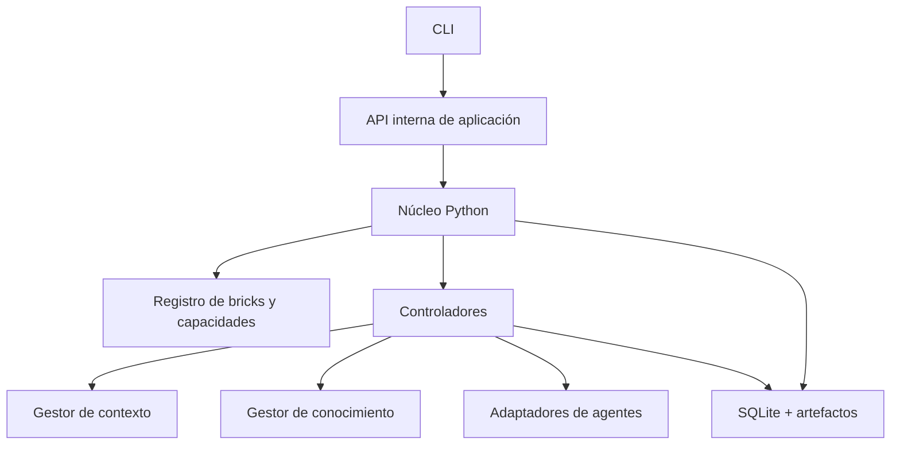
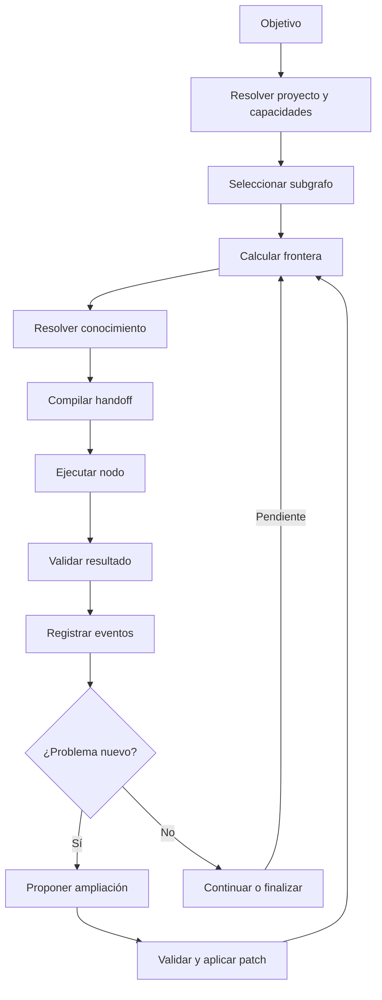

# Arquitectura de referencia

## 1. Capas

## 2. Cuatro vistas funcionales

### Gestión

Objetivos, trabajos, dependencias, autorizaciones,
asignaciones y ampliaciones.

### Comportamiento

Decisiones, acciones, gates, condiciones, control,
composición y subgrafos.

### Conocimiento

Fuentes, entidades, contratos, afirmaciones,
relaciones, evidencias y recorridos transversales.

### Ejecución

Instancias, handoffs, resultados, eventos, estado,
reintentos y puntos de recuperación.

Las cuatro vistas comparten referencias tipadas.
No requieren cuatro motores o bases de datos de grafos.

## 3. Plano de control y plano de ejecución

El plano de control es propietario de:

- Identidad y registro de recursos.
- Validación de contratos.
- Estado y transiciones.
- Autorización de ampliaciones.
- Resolución de dependencias.
- Persistencia y trazabilidad.

El plano de ejecución realiza trabajos concretos
mediante controladores y agentes especializados.

Los agentes no escriben directamente en las tablas
internas del núcleo.

## 4. Flujo principal

## 5. Límites arquitectónicos

El núcleo no debe depender de clases específicas
como SoftwareFile, StoryArc o Character.

Los Domain Packs registran esas especializaciones.

El motor no debe ejecutar código arbitrario incluido
en el YAML.

Los adaptadores externos no son propietarios de la
base de datos ni de las transiciones del workflow.

## 6. Autoridad

- Definiciones: revisión publicada del Domain Pack.
- Código fuente: contenido real del workspace.
- Estado de ejecución: registro transaccional.
- Conocimiento: afirmaciones con fuentes verificables.
- Handoff: instantánea materializada e inmutable.
- Capacidades: política efectiva del entorno de ejecución.

## 7. Arquitectura emergente

Cada nueva abstracción debe responder a un caso concreto.

No implementar un framework distribuido, motor de políticas
complejo o scheduler avanzado antes de demostrar su necesidad.

El primer recorrido completo debe utilizar un proceso
Python, SQLite, agentes simulados y un conjunto reducido
de bricks.
